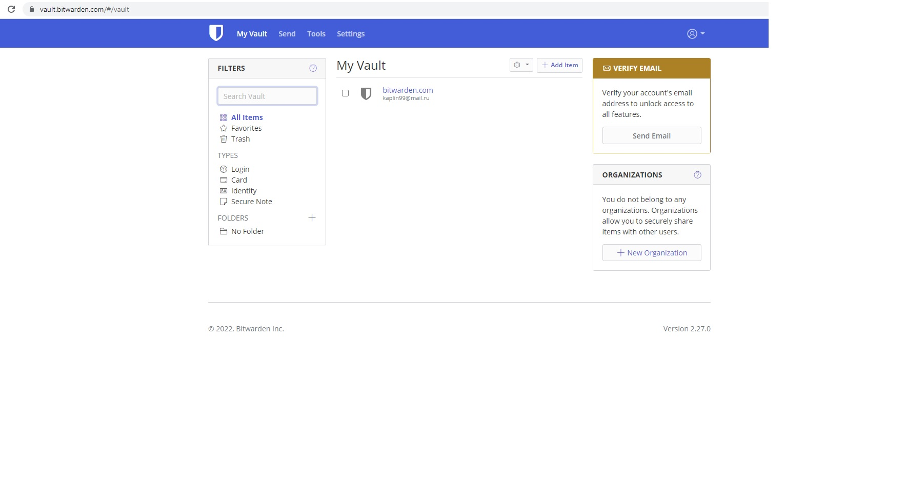
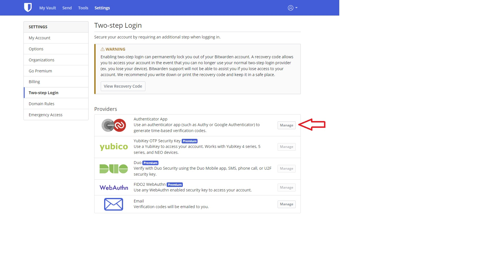
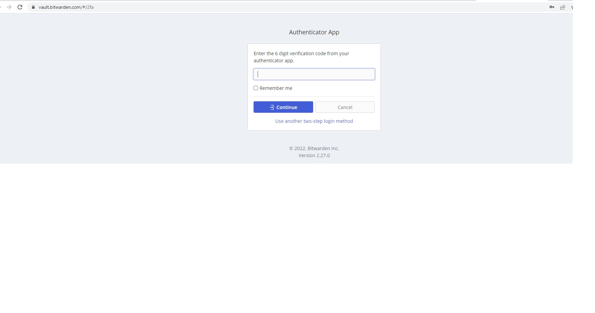
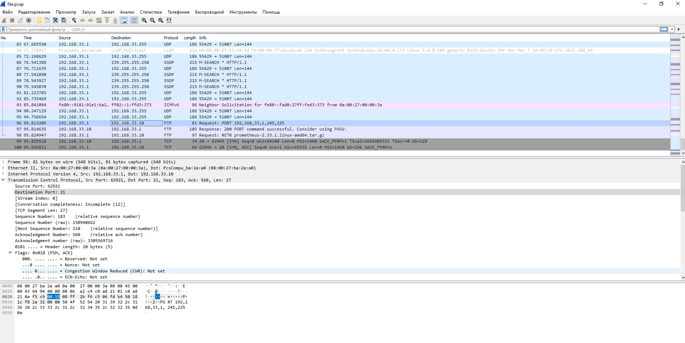

#_Домашнее задание к занятию "3.9. Элементы безопасности информационных систем"_ #
##Выполнил  - Каплин Владимир ##


1. Установите Bitwarden плагин для браузера. Зарегестрируйтесь и сохраните несколько паролей.

- регистрируемся


- устанавливаем плагин в Chrome и сохраняем логин и пароль


2. Установите Google authenticator на мобильный телефон. Настройте вход в Bitwarden акаунт через Google authenticator OTP.
- Подключаем второй фактов, активируем опцию в настройках

- Устанавливаем второй фактор на телефон

- Проверяем вход


Второй фактор работает.

3. Установите apache2, сгенерируйте самоподписанный сертификат, настройте тестовый сайт для работы по HTTPS.

- Устанавливаем Apache
```
vagrant@vagrant:~$ sudo apt install apache2
Reading package lists... Done
Building dependency tree
Reading state information... Done
apache2 is already the newest version (2.4.41-4ubuntu3.10).
The following packages were automatically installed and are no longer required:
  at-spi2-core libatk-bridge2.0-0 libatspi2.0-0 libcolord2 libdrm-amdgpu1 libdrm-intel1 libdrm-nouveau2 libdrm-radeon1 libepoxy0 libfile-basedir-perl libfile-desktopentry-perl libfile-mimeinfo-perl
  libfontenc1 libfwupdplugin1 libgbm1 libgl1 libgl1-mesa-dri libglapi-mesa libglvnd0 libglx-mesa0 libglx0 libgtk-3-0 libgtk-3-bin libgtk-3-common libice6 libio-stringy-perl libipc-system-simple-perl
  libllvm12 libnet-dbus-perl libpciaccess0 librest-0.7-0 libsm6 libsoup-gnome2.4-1 libtie-ixhash-perl libu2f-udev libvulkan1 libwayland-client0 libwayland-cursor0 libwayland-egl1 libwayland-server0
  libx11-protocol-perl libx11-xcb1 libxaw7 libxcb-dri2-0 libxcb-dri3-0 libxcb-glx0 libxcb-present0 libxcb-randr0 libxcb-shape0 libxcb-sync1 libxcb-xfixes0 libxft2 libxkbcommon0 libxkbfile1 libxml-parser-perl
  libxml-twig-perl libxml-xpathengine-perl libxmu6 libxmuu1 libxpm4 libxshmfence1 libxt6 libxtst6 libxv1 libxxf86dga1 libxxf86vm1 mesa-vulkan-drivers x11-common x11-utils x11-xserver-utils xdg-utils
Use 'sudo apt autoremove' to remove them.
0 upgraded, 0 newly installed, 0 to remove and 0 not upgraded.
```
- Активируем службу 
```
sudo systemctl enable apache2
Synchronizing state of apache2.service with SysV service script with /lib/systemd/systemd-sysv-install.
Executing: /lib/systemd/systemd-sysv-install enable apache2
```
- Служба активирована
```
vagrant@vagrant:~$  sudo systemctl status apache2
● apache2.service - The Apache HTTP Server
     Loaded: loaded (/lib/systemd/system/apache2.service; enabled; vendor preset: enabled)
     Active: active (running) since Sun 2022-03-27 15:30:30 UTC; 4min 53s ago
       Docs: https://httpd.apache.org/docs/2.4/
   Main PID: 25532 (apache2)
      Tasks: 7 (limit: 2278)
     Memory: 24.4M
     CGroup: /system.slice/apache2.service
             ├─25532 /usr/sbin/apache2 -k start
             ├─25563 /usr/sbin/apache2 -k start
             ├─25564 /usr/sbin/apache2 -k start
             ├─25565 /usr/sbin/apache2 -k start
             ├─25566 /usr/sbin/apache2 -k start
             ├─25567 /usr/sbin/apache2 -k start
             └─26747 /usr/sbin/apache2 -k start

Mar 27 15:30:30 vagrant systemd[1]: Starting The Apache HTTP Server...
Mar 27 15:30:30 vagrant apachectl[25531]: AH00558: apache2: Could not reliably determine the server's fully qualified domain name, using 127.0.1.1. Set the 'ServerName' directive globally to suppress this mes>
Mar 27 15:30:30 vagrant systemd[1]: Started The Apache HTTP Server.
```

- Создаем католог для тестового  сайта и тестовую страницу.

```
vagrant@vagrant:~$ cd /var/www/
vagrant@vagrant:/var/www$ sudo mkdir test-site
vagrant@vagrant:/var/www/test-site$ sudo touch index.html
vagrant@vagrant:/var/www/test-site$ sudo vi index.html
vagrant@vagrant:/var/www/test-site$ cat index.html
<html>
<head>
  <title> Ubuntu rocks! </title>
</head>
<body>
  <p> I'm running this test website using HTTPS!
</body>
</html>
```
- скопируем файл настроек для тестового сайта и отредактируем его
```
vagrant@vagrant:/etc/apache2/sites-available$ sudo cp default-ssl.conf test-ssl.conf
vagrant@vagrant:/etc/apache2/sites-available$ sudo vi test-ssl.conf
```

- активируем модуль ssl
sudo a2enmod ssl
- 
4. Проверьте на TLS уязвимости произвольный сайт в интернете (кроме сайтов МВД, ФСБ, МинОбр, НацБанк, РосКосмос, РосАтом, РосНАНО и любых госкомпаний, объектов КИИ, ВПК ... и тому подобное).

- установим средство 

```
vagrant@vagrant:~$ git clone --depth 1 https://github.com/drwetter/testssl.sh.git
Cloning into 'testssl.sh'...
remote: Enumerating objects: 100, done.
remote: Counting objects: 100% (100/100), done.
remote: Compressing objects: 100% (93/93), done.
remote: Total 100 (delta 13), reused 32 (delta 6), pack-reused 0
Receiving objects: 100% (100/100), 8.57 MiB | 851.00 KiB/s, done.
Resolving deltas: 100% (13/13), done.
```
- и проверим новостной сайт на проникновение с ключом -u

```
vagrant@vagrant:~/testssl.sh$ ./testssl.sh -U --sneaky https://www.eurointegration.com.ua/

###########################################################
    testssl.sh       3.1dev from https://testssl.sh/dev/
    (90c6134 2022-03-16 15:25:06 -- )

      This program is free software. Distribution and
             modification under GPLv2 permitted.
      USAGE w/o ANY WARRANTY. USE IT AT YOUR OWN RISK!

       Please file bugs @ https://testssl.sh/bugs/

###########################################################

 Using "OpenSSL 1.0.2-chacha (1.0.2k-dev)" [~183 ciphers]
 on vagrant:./bin/openssl.Linux.x86_64
 (built: "Jan 18 17:12:17 2019", platform: "linux-x86_64")


 Start 2022-03-27 20:24:22        -->> 130.211.29.18:443 (www.eurointegration.com.ua) <<--

 rDNS (130.211.29.18):   18.29.211.130.bc.googleusercontent.com.
 Service detected:       HTTP


 Testing vulnerabilities

 Heartbleed (CVE-2014-0160)                not vulnerable (OK), no heartbeat extension
 CCS (CVE-2014-0224)                       not vulnerable (OK)
 Ticketbleed (CVE-2016-9244), experiment.  not vulnerable (OK)
 ROBOT                                     Server does not support any cipher suites that use RSA key transport
 Secure Renegotiation (RFC 5746)           supported (OK)
 Secure Client-Initiated Renegotiation     not vulnerable (OK)
 CRIME, TLS (CVE-2012-4929)                not vulnerable (OK)
 BREACH (CVE-2013-3587)                    potentially NOT ok, "br" HTTP compression detected. - only supplied "/" tested
                                           Can be ignored for static pages or if no secrets in the page
 POODLE, SSL (CVE-2014-3566)               not vulnerable (OK)
 TLS_FALLBACK_SCSV (RFC 7507)              Downgrade attack prevention supported (OK)
 SWEET32 (CVE-2016-2183, CVE-2016-6329)    not vulnerable (OK)
 FREAK (CVE-2015-0204)                     not vulnerable (OK)
 DROWN (CVE-2016-0800, CVE-2016-0703)      not vulnerable on this host and port (OK)
                                           no RSA certificate, thus certificate can't be used with SSLv2 elsewhere
 LOGJAM (CVE-2015-4000), experimental      not vulnerable (OK): no DH EXPORT ciphers, no DH key detected with <= TLS 1.2
 BEAST (CVE-2011-3389)                     TLS1: ECDHE-ECDSA-AES128-SHA ECDHE-ECDSA-AES256-SHA
                                           VULNERABLE -- but also supports higher protocols  TLSv1.1 TLSv1.2 (likely mitigated)
 LUCKY13 (CVE-2013-0169), experimental     potentially VULNERABLE, uses cipher block chaining (CBC) ciphers with TLS. Check patches
 Winshock (CVE-2014-6321), experimental    not vulnerable (OK)
 RC4 (CVE-2013-2566, CVE-2015-2808)        no RC4 ciphers detected (OK)


 Done 2022-03-27 20:24:48 [  31s] -->> 130.211.29.18:443 (www.eurointegration.com.ua) <<--```

```
5. Установите на Ubuntu ssh сервер, сгенерируйте новый приватный ключ. Скопируйте свой публичный ключ на другой сервер. 
Подключитесь к серверу по SSH-ключу.

- Установим и запустим SSH сервер
```
vagrant@vagrant:/usr/share/doc/apache2$ sudo apt install openssh-server
vagrant@vagrant:/usr/share/doc/apache2$ sudo systemctl enable sshd
vagrant@vagrant:/usr/share/doc/apache2$ sudo systemctl status sshd
● ssh.service - OpenBSD Secure Shell server
     Loaded: loaded (/lib/systemd/system/ssh.service; enabled; vendor preset: enabled)
     Active: active (running) since Sun 2022-03-27 15:30:28 UTC; 1 day 3h ago
       Docs: man:sshd(8)
             man:sshd_config(5)
   Main PID: 25414 (sshd)
      Tasks: 1 (limit: 2278)
     Memory: 6.3M
     CGroup: /system.slice/ssh.service
             └─25414 sshd: /usr/sbin/sshd -D [listener] 0 of 10-100 startups

Mar 27 15:30:28 vagrant systemd[1]: Starting OpenBSD Secure Shell server...
Mar 27 15:30:28 vagrant sshd[25414]: Server listening on 0.0.0.0 port 22.
Mar 27 15:30:28 vagrant sshd[25414]: Server listening on :: port 22.
Mar 27 15:30:28 vagrant systemd[1]: Started OpenBSD Secure Shell server.
Mar 27 18:45:34 vagrant sshd[50662]: Accepted publickey for vagrant from 10.0.2.2 port 54129 ssh2: RSA SHA256:nNgKDDftYRRTDnkKM2SQC6t8xRdpiUn1djVnn793m1s
Mar 27 18:45:34 vagrant sshd[50662]: pam_unix(sshd:session): session opened for user vagrant by (uid=0)
Mar 27 20:11:05 vagrant sshd[51200]: Accepted publickey for vagrant from 10.0.2.2 port 56373 ssh2: RSA SHA256:nNgKDDftYRRTDnkKM2SQC6t8xRdpiUn1djVnn793m1s
Mar 27 20:11:05 vagrant sshd[51200]: pam_unix(sshd:session): session opened for user vagrant by (uid=0)
```

- сгенерируем ключ
```
vagrant@vagrant:~$ ssh-keygen
Generating public/private rsa key pair.
Enter file in which to save the key (/home/vagrant/.ssh/id_rsa):
Enter passphrase (empty for no passphrase):
Enter same passphrase again:
Your identification has been saved in /home/vagrant/.ssh/id_rsa
Your public key has been saved in /home/vagrant/.ssh/id_rsa.pub
The key fingerprint is:
SHA256:tEF/20O5Hfi8+7sgdPkFAyqmZo39bS9KQAiJBqVnarM vagrant@vagrant
The key's randomart image is:
+---[RSA 3072]----+
|.o....  .   .    |
| .o .. o . . ... |
|..o   . * o ..=. |
| +     O + . ++=.|
|.o    = S  ..o+oo|
|. o  o   o... ..o|
| E        o.o. o |
|         . .o.. .|
|          .. ..+=|
+----[SHA256]-----+

```

- отправим публичный ключ на физический хост 
```
vagrant@vagrant:~$ cd /home/vagrant/.ssh/
vagrant@vagrant:~/.ssh$ cp /home/vagrant/.ssh/id_rsa.pub /home/vagrant/
vagrant@vagrant:~/.ssh$ echo /home/vagrant/.ssh/id_rsa.pub
/home/vagrant/.ssh/id_rsa.pub
vagrant@vagrant:~/.ssh$ ssh-copy-id -i ~/.ssh/id_rsa.pub vagrant@192.168.33.11
/usr/bin/ssh-copy-id: INFO: Source of key(s) to be installed: "/home/vagrant/.ssh/id_rsa.pub"
The authenticity of host '192.168.33.11 (192.168.33.11)' can't be established.
ECDSA key fingerprint is SHA256:RztZ38lZsUpiN3mQrXHa6qtsUgsttBXWJibL2nAiwdQ.
Are you sure you want to continue connecting (yes/no/[fingerprint])? yes
/usr/bin/ssh-copy-id: INFO: attempting to log in with the new key(s), to filter out any that are already installed
/usr/bin/ssh-copy-id: INFO: 1 key(s) remain to be installed -- if you are prompted now it is to install the new keys
vagrant@192.168.33.11's password:

Number of key(s) added: 1

Now try logging into the machine, with:   "ssh 'vagrant@192.168.33.11'"
and check to make sure that only the key(s) you wanted were added.
```

- зайдем на удаленный сервер 192.168.33.11
```

vagrant@vagrant:~/.ssh$ ssh vagrant@192.168.33.11
Welcome to Ubuntu 20.04.3 LTS (GNU/Linux 5.4.0-91-generic x86_64)

 * Documentation:  https://help.ubuntu.com
 * Management:     https://landscape.canonical.com
 * Support:        https://ubuntu.com/advantage

  System information as of Tue 29 Mar 2022 08:26:40 PM UTC

  System load:  0.25               Processes:             152
  Usage of /:   13.1% of 30.88GB   Users logged in:       1
  Memory usage: 11%                IPv4 address for eth0: 10.0.2.15
  Swap usage:   0%                 IPv4 address for eth1: 192.168.33.11


This system is built by the Bento project by Chef Software
More information can be found at https://github.com/chef/bento
Last login: Tue Mar 29 20:24:47 2022 from 10.0.2.2
vagrant@vagrant:~$
```

6. Переименуйте файлы ключей из задания 5. Настройте файл конфигурации SSH клиента, 
так чтобы вход на удаленный сервер осуществлялся по имени сервера.

- создаим файл конфигурации, чтобы заходить по имени
```
vagrant@vagrant:~/.ssh$ sudo touch config
vagrant@vagrant:~/.ssh$ sudo vi config
vagrant@vagrant:~/.ssh$ rn -h
-bash: rn: command not found
vagrant@vagrant:~/.ssh$ rname
-bash: rname: command not found
vagrant@vagrant:~/.ssh$ cat config
Host S_K
    HostName 192.168.33.11
    User vagrant
    Port 22
    IdentityFile ~/.ssh/kaplin.key
vagrant@vagrant:~/.ssh$ mv id_rsa kaplin.key
vagrant@vagrant:~/.ssh$ ls -al
total 40
drwx------ 2 vagrant root    4096 Mar 29 20:38 .
drwxr-xr-x 9 vagrant vagrant 4096 Mar 29 20:01 ..
-rw------- 1 vagrant vagrant  389 Jan  8 16:37 authorized_keys
-rw-r--r-- 1 root    root     100 Mar 29 20:36 config
-rw-r--r-- 1 vagrant vagrant  569 Mar 29 19:59 id_rsa.pub
-rw------- 1 vagrant vagrant 2602 Mar 29 19:59 kaplin.key
-rw------- 1 vagrant vagrant  444 Mar 29 20:23 known_hosts
-rw-r--r-- 1 vagrant vagrant  444 Mar 28 19:15 known_hosts.old
-rw------- 1 vagrant vagrant 2602 Mar 28 20:23 y
-rw-r--r-- 1 vagrant vagrant  569 Mar 28 20:23 y.pub
```

- попробуем зайти по имени S_K, видно что вход выполняется успешно.
```
vagrant@vagrant:~/.ssh$ ssh S_K
Welcome to Ubuntu 20.04.3 LTS (GNU/Linux 5.4.0-91-generic x86_64)

 * Documentation:  https://help.ubuntu.com
 * Management:     https://landscape.canonical.com
 * Support:        https://ubuntu.com/advantage

  System information as of Tue 29 Mar 2022 08:41:46 PM UTC

  System load:  0.0                Processes:             143
  Usage of /:   13.1% of 30.88GB   Users logged in:       1
  Memory usage: 11%                IPv4 address for eth0: 10.0.2.15
  Swap usage:   0%                 IPv4 address for eth1: 192.168.33.11


This system is built by the Bento project by Chef Software
More information can be found at https://github.com/chef/bento
Last login: Tue Mar 29 20:26:41 2022 from 192.168.33.10
vagrant@vagrant:~$
```
7. Соберите дамп трафика утилитой tcpdump в формате pcap, 100 пакетов. Откройте файл pcap в Wireshark.

- запустим команду tcpdump с опциями -с и -w для интерфейса eth1. Создадим трафик, выкачивая файл через ftp c windows машины


```
vagrant@vagrant:~$ sudo tcpdump  -c 100 -w file.pcap -i eth1
tcpdump: listening on eth1, link-type EN10MB (Ethernet), capture size 262144 bytes
100 packets captured
184 packets received by filter
0 packets dropped by kernel
```

```
PS C:\Users\kapli> ftp 192.168.33.10
Связь с 192.168.33.10.
220 (vsFTPd 3.0.3)
200 Always in UTF8 mode.
Пользователь (192.168.33.10:(none)): vagrant
331 Please specify the password.
Пароль:
230 Login successful.
ftp> dir
200 PORT command successful. Consider using PASV.
150 Here comes the directory listing.
-rw-rw-r--    1 1000     1000         1624 Feb 13 19:27 2.txt
-rw-rw-r--    1 1000     1000           30 Feb 02 20:08 file
-rw-r--r--    1 108      113          4096 Mar 29 21:22 file.pcap
-rw-rw-r--    1 1000     1000           13 Jan 26 21:22 file1
-rw-rw-r--    1 1000     1000         9022 Feb 02 20:08 file3
-rw-r--r--    1 0        0               7 Mar 13 20:12 file_ping
-rw-r--r--    1 1000     1000          569 Mar 29 20:01 id_rsa.pub
-rw-------    1 1000     1000         2602 Mar 28 19:56 kapli
-rw-r--r--    1 1000     1000          569 Mar 28 19:56 kapli.pub
-rw-r--r--    1 0        0               0 Mar 01 21:42 node-exporter.service
drwxr-xr-x    2 1000     1000         4096 Mar 01 22:36 node_exporter-1.3.1.linux-amd64
-rw-rw-r--    1 1000     1000      9033415 Dec 08 08:52 node_exporter-1.3.1.linux-amd64.tar.gz
drwxr-xr-x    5 1000     1000         4096 Feb 09 20:05 prometheus-2.33.1.linux-amd64
-rw-rw-r--    1 1000     1000     75820306 Feb 02 15:43 prometheus-2.33.1.linux-amd64.tar.gz
-rw-rw-r--    1 1000     1000            0 Feb 02 21:15 stop
drwxrwxr-x    9 1000     1000         4096 Mar 27 20:11 testssl.sh
-rw-------    1 1000     1000         2602 Mar 28 21:39 y
-rw-r--r--    1 1000     1000          569 Mar 28 21:13 y.pub
-rw-r--r--    1 1000     1000       106151 Feb 08 19:57 ystemctl status nginx.service
ftp> get prometheus-2.33.1.linux-amd64.tar.gz
200 PORT command successful. Consider using PASV.
150 Opening BINARY mode data connection for prometheus-2.33.1.linux-amd64.tar.gz (75820306 bytes).
226 Transfer complete.
ftp: 75820306 байт получено за 2.94 (сек) со скоростью 25771.69 (КБ/сек).
ftp> get file.pcap
421 Timeout.

```

- видим сформированный файл в формате pcap
```
vagrant@vagrant:~$ ls -al
-rw-r--r-- 1 tcpdump tcpdump    18925 Mar 29 21:25  file.pcap
```
- ниже скриншоты из Wireshark
